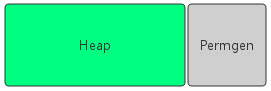
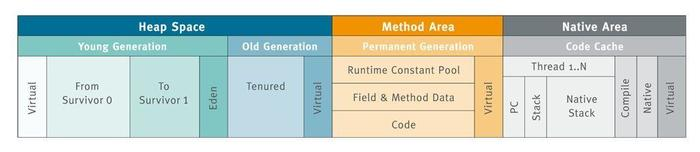
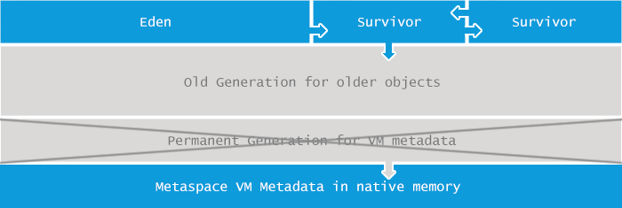
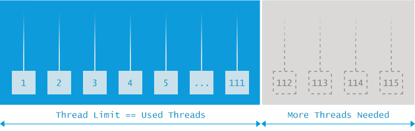
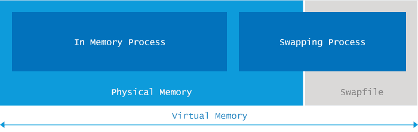
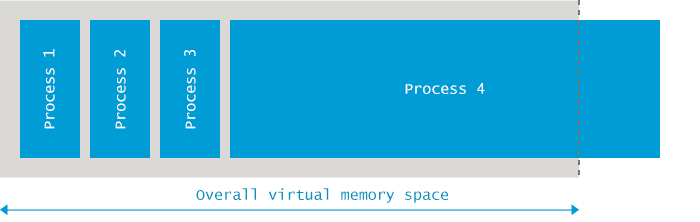

# 垃圾回收机制
垃圾回收包含的内容不少，但顺着下面的顺序捋清知识也并不难。首先要搞清垃圾回收的范围（栈需要GC去回收吗？），然后就是回收的前提条件
如何判断一个对象已经可以被回收（这里只重点学习根搜索算法就行了），
之后便是建立在根搜索基础上的三种回收策略，最后便是JVM中对这三种
策略的具体实现。
### 1.范围：要回收哪些区域？
Java方法栈、本地方法栈以及PC计数器随方法或线程的结束而自然被回收，
所以这些区域不需要考虑回收问题。Java堆和方法区是GC回收的重点区域，
因为一个接口的多个实现类需要的内存不一样，一个方法的多个分支需要
的内存可能也不一样，而这两个区域又对立于栈可能随时都会有对象不再
被引用，因此这部分内存的分配和回收都是动态的。
### 2.前提：如何判断对象已死？
1. 引用计数法
引用计数法就是通过一个计数器记录该对象被引用的次数，方法简单高效，但是解决不了循环引用的问题。比如对象A包含指向对象B的引用，对象B
也包含指向对象A的引用，但没有引用指向A和B，这时当前回收如果采用的
是引用计数法，那么对象A和B的被引用次数都为1，都不会被回收。<br>
下面是循环引用的例子，在Hotspot JVM下可以被正常回收，可以证实JVM
采用的不是简单的引用计数法。通过-XX:+PrintGCDetails输出GC日志。<br>
```java
package com.cdai.jvm.gc;  
public class ReferenceCount {  
    final static int MB = 1024 * 1024;  
    byte[] size = new byte[2 * MB];  
    Object ref;  
	
    public static void main(String[] args) {  
        ReferenceCount objA = new ReferenceCount();  
        ReferenceCount objB = new ReferenceCount();  

        objA.ref = objB;  
        objB.ref = objA;  
         
        objA = null;  
        objB = null;  

        System.gc();  
        System.gc();  
    }
}  
//[Full GC (System) [Tenured: 2048K->366K(10944K), 0.0046272 secs] 4604K->366K(15872K), [Perm : 154K->154K(12288K)], 0.0046751 secs] [Times: user=0.02 sys=0.00, real=0.00 secs]
``` 
2. 根搜索
通过选取一些根对象作为起始点，开始向下搜索，如果一个对象到根对象
不可达时，则说明此对象已经没有被引用，是可以被回收的。可以作为根的
对象有：栈中变量引用的对象，类静态属性引用的对象，常量引用的对象等。
因为每个线程都有一个栈，所以我们需要选取多个根对象。<br>在根搜索中得到的不可达对象并不是立即就被标记成可回收的，而是先进行一次
标记放入F-Queue等待执行对象的finalize()方法，执行后GC将进行二次标记，复活
的对象之后将不会被回收。因此，使对象复活的唯一办法就是重写finalize()方法，
并使对象重新被引用。
```java
package com.cdai.jvm.gc;  
public class DeadToRebirth {  
    private static DeadToRebirth hook;   
    @Override  

    public void finalize() throws Throwable {  
        super.finalize();  
        DeadToRebirth.hook = this;  
    }  
    public static void main(String[] args) throws Exception {  
        DeadToRebirth.hook = new DeadToRebirth();  
        DeadToRebirth.hook = null;  
        System.gc();  
        Thread.sleep(500);  
        if (DeadToRebirth.hook != null)  
            System.out.println("Rebirth!");  
        else  
            System.out.println("Dead!"); 
        DeadToRebirth.hook = null;  
        System.gc();  
        Thread.sleep(500);  
        if (DeadToRebirth.hook != null)  
            System.out.println("Rebirth!");  
        else  
            System.out.println("Dead!");  
    }
}  
/**
要注意的两点是：
第一，finalize()方法只会被执行一次，所以对象只有一次复活的机会。
第二，执行GC后，要停顿半秒等待优先级很低的finalize()执行完毕。
**/
```
### 3.策略：垃圾回收的算法
1. 标记-清除
没错，这里的标记指的就是之前我们介绍过的两次标记过程。标记完成后就可以
对标记为垃圾的对象进行回收了。怎么样，简单吧。但是这种策略的缺点很明显，
回收后内存碎片很多，如果之后程序运行时申请大内存，可能会又导致一次GC。
虽然缺点明显，这种策略却是后两种策略的基础。正因为它的缺点，所以促成了
后两种策略的产生。
2. 标记-复制
将内存分为两块，标记完成开始回收时，将一块内存中保留的对象全部复制到另
一块空闲内存中。实现起来也很简单，当大部分对象都被回收时这种策略也很高效。
但这种策略也有缺点，可用内存变为一半了！<br>
怎样解决呢？聪明的程序员们总是办法多过问题的。可以将堆不按1:1的比例分离，
而是按8:1:1分成一块Eden和两小块Survivor区，每次将Eden和Survivor中存活的对象
复制到另一块空闲的Survivor中。这三块区域并不是堆的全部，而是构成了新生代。<br>
在GC开始的时候，对象只会存在于Eden区和名为“From”的Survivor区，Survivor区“To”是空的。紧接着进行GC，Eden区中所有存活的对象都会被复制到“To”，而在“From”区中，仍存活的对象会根据他们的年龄值来决定去向。年龄达到一定值(年龄阈值，可以通过-XX:MaxTenuringThreshold来设置)的对象会被移动到年老代中，没有达到阈值的对象会被复制到“To”区域。经过这次GC后，Eden区和From区已经被清空。这个时候，“From”和“To”会交换他们的角色，也就是新的“To”就是上次GC前的“From”，新的“From”就是上次GC前的“To”。不管怎样，都会保证名为To的Survivor区域是空的。Minor GC会一直重复这样的过程，直到“To”区被填满，“To”区被填满之后，会将所有对象移动到年老代中。<br>

* 一个对象的这一辈子
我是一个普通的Java对象，我出生在Eden区，在Eden区我还看到和我长的很像的小兄弟，我们在Eden区中玩了挺长时间。有一天Eden区中的人实在是太多了，我就被迫去了Survivor区的“From”区，自从去了Survivor区，我就开始漂了，有时候在Survivor的“From”区，有时候在Survivor的“To”区，居无定所。直到我18岁的时候，爸爸说我成人了，该去社会上闯闯了。于是我就去了年老代那边，年老代里，人很多，并且年龄都挺大的，我在这里也认识了很多人。在年老代里，我生活了20年(每次GC加一岁)，然后被回收。<br>
* 有关年轻代的JVM参数
1)-XX:NewSize和-XX:MaxNewSize<br>

用于设置年轻代的大小，建议设为整个堆大小的1/3或者1/4,两个值设为一样大。<br>

2)-XX:SurvivorRatio<br>

用于设置Eden和其中一个Survivor的比值，这个值也比较重要。<br>

3)-XX:+PrintTenuringDistribution<br>

这个参数用于显示每次Minor GC时Survivor区中各个年龄段的对象的大小。<br>

4).-XX:InitialTenuringThreshol和-XX:MaxTenuringThreshold<br>

用于设置晋升到老年代的对象年龄的最小值和最大值，每个对象在坚持过一次Minor GC之后，年龄就加1。<br>
3. 标记-整理
标记整理算法的“标记”过程和标记-清除算法一致，只是后面并不是直接对可回收对象进行整理，而是让所有存活的对象都向一段移动，然后直接清理掉端边界意外的内存。
### 4. 实现：虚拟机中的收集器
（1）新生代上的GC实现<br>
Serial：单线程的收集器，只使用一个线程进行收集，并且收集时会暂停其他所有
工作线程（Stop the world）。它是Client模式下的默认新生代收集器。<br>
ParNew：Serial收集器的多线程版本。在单CPU甚至两个CPU的环境下，由于线程
交互的开销，无法保证性能超越Serial收集器。<br>
Parallel Scavenge：也是多线程收集器，与ParNew的区别是，它是吞吐量优先
收集器。吞吐量=运行用户代码时间/(运行用户代码+垃圾收集时间)。另一点区别
是配置-XX:+UseAdaptiveSizePolicy后，虚拟机会自动调整Eden/Survivor等参数来
提供用户所需的吞吐量。我们需要配置的就是内存大小-Xmx和吞吐量GCTimeRatio。<br>
（2）老年代上的GC实现

Serial Old：Serial收集器的老年代版本。<br>
Parallel Old：Parallel Scavenge的老年代版本。此前，如果新生代采用PS GC的话，<br>
老年代只有Serial Old能与之配合。现在有了Parallel Old与之配合，可以在注重吞吐量
及CPU资源敏感的场合使用了。<br>
CMS：采用的是标记-清除而非标记-整理，是一款并发低停顿的收集器。但是由于
采用标记-清除，内存碎片问题不可避免。可以使用-XX:CMSFullGCsBeforeCompaction
设置执行几次CMS回收后，跟着来一次内存碎片整理。<br>
### 5. 触发：何时开始GC？
Minor GC（新生代回收）的触发条件比较简单，Eden空间不足就开始进行Minor GC
回收新生代。<br>
而Full GC（老年代回收，一般伴随一次Minor GC）则有几种触发条件：
* 老年代空间不足
* PermSpace空间不足
* 统计得到的Minor GC晋升到老年代的平均大小大于老年代的剩余空间
这里注意一点：PermSpace并不等同于方法区，只不过是Hotspot JVM用PermSpace来
实现方法区而已，有些虚拟机没有PermSpace而用其他机制来实现方法区。
### 6. 补充：对象的空间分配和晋升
* 对象优先在Eden上分配
* 大对象直接进入老年代
虚拟机提供了-XX:PretenureSizeThreshold参数，大于这个参数值的对象将直接分配到
老年代中。因为新生代采用的是标记-复制策略，在Eden中分配大对象将会导致Eden区
和两个Survivor区之间大量的内存拷贝。
* 长期存活的对象将进入老年代
对象在Survivor区中每熬过一次Minor GC，年龄就增加1岁，当它的年龄增加到一定程度
（默认为15岁）时，就会晋升到老年代中。

# Java内存溢出(OOM)异常完全指南
## 1.java.lang.OutOfMemoryError:Java heap space
Java应用程序在启动时会指定所需要的内存大小，它被分割成两个不同的区域：Heap space（堆空间）和Permgen（永久代）：
<br>
这两个区域的大小可以在JVM（Java虚拟机）启动时通过参数-Xmx和-XX:MaxPermSize设置，如果你没有显式设置，则将使用特定平台的默认值。<br>
当应用程序试图向堆空间添加更多的数据，但堆却没有足够的空间来容纳这些数据时，将会触发java.lang.OutOfMemoryError: Java heap space异常。需要注意的是：即使有足够的物理内存可用，只要达到堆空间设置的大小限制，此异常仍然会被触发。<br>
### 原因分析
触发java.lang.OutOfMemoryError: Java heap space最常见的原因就是应用程序需要的堆空间是XXL号的，但是JVM提供的却是S号。解决方法也很简单，提供更大的堆空间即可。除了前面的因素还有更复杂的成因：
* 流量/数据量峰值：应用程序在设计之初均有用户量和数据量的限制，某一时刻，当用户数量或数据量突然达到一个峰值，并且这个峰值已经超过了设计之初预期的阈值，那么以前正常的功能将会停止，并触发java.lang.OutOfMemoryError: Java heap space异常。
* 内存泄漏：特定的编程错误会导致你的应用程序不停的消耗更多的内存，每次使用有内存泄漏风险的功能就会留下一些不能被回收的对象到堆空间中，随着时间的推移，泄漏的对象会消耗所有的堆空间，最终触发java.lang.OutOfMemoryError: Java heap space错误。
## 2.java.lang.OutOfMemoryError:GC overhead limit exceeded（超出GC开销限制）
Java运行时环境（JRE）包含一个内置的垃圾回收进程，而在许多其他的编程语言中，开发者需要手动分配和释放内存。
Java应用程序只需要开发者分配内存，每当在内存中特定的空间不再使用时，一个单独的垃圾收集进程会清空这些内存空间。垃圾收集器怎样检测内存中的某些空间不再使用已经超出本文的范围，但你只需要相信GC可以做好这些工作即可。
默认情况下，当应用程序花费超过98%的时间用来做GC并且回收了不到2%的堆内存时，会抛出java.lang.OutOfMemoryError:GC overhead limit exceeded错误。具体的表现就是你的应用几乎耗尽所有可用内存，并且GC多次均未能清理干净。
### 原因分析
java.lang.OutOfMemoryError:GC overhead limit exceeded错误是一个信号，示意你的应用程序在垃圾收集上花费了太多时间但却没有什么卵用。默认超过98%的时间用来做GC却回收了不到2%的内存时将会抛出此错误。那如果没有此限制会发生什么呢？GC进程将被重启，100%的CPU将用于GC，而没有CPU资源用于其他正常的工作。如果一个工作本来只需要几毫秒即可完成，现在却需要几分钟才能完成，我想这种结果谁都没有办法接受。
## 3.java.lang.OutOfMemoryError:Permgen space
Java中堆空间是JVM管理的最大一块内存空间，可以在JVM启动时指定堆空间的大小，其中堆被划分成两个不同的区域：新生代（Young）和老年代（Tenured），新生代又被划分为3个区域：Eden、From Survivor、To Survivor，如下图所示。
<br>
java.lang.OutOfMemoryError: PermGen space错误就表明持久代所在区域的内存已被耗尽。
### 原因分析
要理解java.lang.OutOfMemoryError: PermGen space出现的原因，首先需要理解Permanent Generation Space的用处是什么。持久代主要存储的是每个类的信息，比如：类加载器引用、运行时常量池（所有常量、字段引用、方法引用、属性）、字段(Field)数据、方法(Method)数据、方法代码、方法字节码等等。我们可以推断出，PermGen的大小取决于被加载类的数量以及类的大小。
<br>
因此，我们可以得出出现java.lang.OutOfMemoryError: PermGen space错误的原因是：太多的类或者太大的类被加载到permanent generation（持久代）。
## 4.java.lang.OutOfMemoryError:Metaspace
PermGen区域用于存储类的名称和字段，类的方法，方法的字节码，常量池，JIT优化等，但从Java8开始，Java中的内存模型发生了重大变化：引入了称为Metaspace的新内存区域，而删除了PermGen区域。请注意：不是简单的将PermGen区所存储的内容直接移到Metaspace区，PermGen区中的某些部分，已经移动到了普通堆里面。
<br>
### 原因分析
Java8做出如此改变的原因包括但不限于：
* 应用程序所需要的PermGen区大小很难预测，设置太小会触发PermGen OutOfMemoryError错误，过度设置导致资源浪费。
* 提升GC性能，在HotSpot中的每个垃圾收集器需要专门的代码来处理存储在PermGen中的类的元数据信息。从PermGen分离类的元数据信息到Metaspace，由于Metaspace的分配具有和Java Heap相同的地址空间，因此Metaspace和Java Heap可以无缝的管理，而且简化了FullGC的过程，以至将来可以并行的对元数据信息进行垃圾收集，而没有GC暂停。
* 支持进一步优化，比如：G1并发类的卸载，也算为将来做准备吧.
正如你所看到的，元空间大小的要求取决于加载的类的数量以及这种类声明的大小。 所以很容易看到java.lang.OutOfMemoryError: Metaspace主要原因：太多的类或太大的类加载到元空间。
## 5.java.lang.OutOfMemoryError:Unable to create new native thread
一个思考线程的方法是将线程看着是执行任务的工人，如果你只有一个工人，那么他同时只能执行一项任务，但如果你有十几个工人，就可以同时完成你几个任务。就像这些工人都在物理世界，JVM中的线程完成自己的工作也是需要一些空间的，当有足够多的线程却没有那么多的空间时就会像这样：
<br>
出现java.lang.OutOfMemoryError:Unable to create new native thread就意味着Java应用程序已达到其可以启动线程数量的极限了。
### 原因分析
当JVM向OS请求创建一个新线程时，而OS却无法创建新的native线程时就会抛出Unable to create new native thread错误。一台服务器可以创建的线程数依赖于物理配置和平台，建议运行下文中的示例代码来测试找出这些限制。总体上来说，抛出此错误会经过以下几个阶段：
* 运行在JVM内的应用程序请求创建一个新的线程
* JVM向OS请求创建一个新的native线程
* OS尝试创建一个新的native线程，这时需要分配内存给新的线程
* OS拒绝分配内存给线程，因为32位Java进程已经耗尽内存地址空间（2-4GB内存地址已被命中）或者OS的虚拟内存已经完全耗尽
* Unable to create new native thread错误将被抛出
## 6.java.lang.OutOfMemoryError:Out of swap space?
Java应用程序在启动时会指定所需要的内存大小，可以通过-Xmx和其他类似的启动参数来指定。在JVM请求的总内存大于可用物理内存的情况下，操作系统会将内存中的数据交换到磁盘上去。
<br>
Out of swap space?表示交换空间也将耗尽，并且由于缺少物理内存和交换空间，再次尝试分配内存也将失败。
### 原因分析
java.lang.OutOfMemoryError:Out of swap space?往往是由操作系统级别的问题引起的，例如：
* 操作系统配置的交换空间不足。
* 系统上的另一个进程消耗所有内存资源。
* 还有可能是本地内存泄漏导致应用程序失败，比如：应用程序调用了native code连续分配内存，但却没有被释放。
## 7.java.lang.OutOfMemoryError:Requested array size exceeds VM limit
Java对应用程序可以分配的最大数组大小有限制。不同平台限制有所不同，但通常在1到21亿个元素之间。<br>
当你遇到Requested array size exceeds VM limit错误时，意味着你的应用程序试图分配大于Java虚拟机可以支持的数组。
## 8.Out of memory:Kill process or sacrifice child
为了理解这个错误，我们需要补充一点操作系统的基础知识。操作系统是建立在进程的概念之上，这些进程在内核中作业，其中有一个非常特殊的进程，名叫“内存杀手（Out of memory killer）”。当内核检测到系统内存不足时，OOM killer被激活，然后选择一个进程杀掉。哪一个进程这么倒霉呢？选择的算法和想法都很朴实：谁占用内存最多，谁就被干掉。
<br>
当可用虚拟虚拟内存(包括交换空间)消耗到让整个操作系统面临风险时，就会产生Out of memory:Kill process or sacrifice child错误。在这种情况下，OOM Killer会选择“流氓进程”并杀死它。
### 原因分析
默认情况下，Linux内核允许进程请求比系统中可用内存更多的内存，但大多数进程实际上并没有使用完他们所分配的内存。这就跟现实生活中的宽带运营商类似，他们向所有消费者出售一个100M的带宽，远远超过用户实际使用的带宽，一个10G的链路可以非常轻松的服务100个(10G/100M)用户，但实际上宽带运行商往往会把10G链路用于服务150人或者更多，以便让链路的利用率更高，毕竟空闲在那儿也没什么意义。
Linux内核采用的机制跟宽带运营商差不多，一般情况下都没有问题，但当大多数应用程序都消耗完自己的内存时，麻烦就来了，因为这些应用程序的内存需求加起来超出了物理内存（包括 swap）的容量，内核（OOM killer）必须杀掉一些进程才能腾出空间保障系统正常运行。就如同上面的例子中，如果150人都占用100M的带宽，那么总的带宽肯定超过了10G这条链路能承受的范围。
